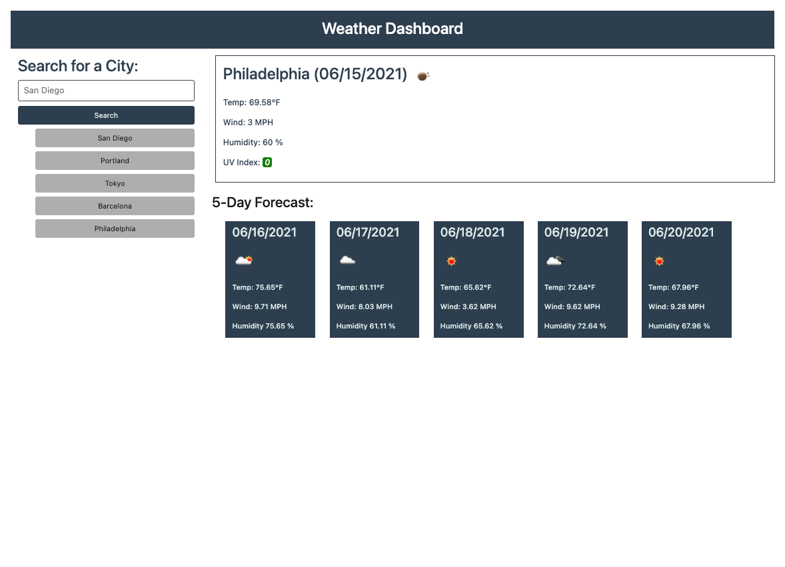

# The Weather Dashboard

## A weather app that runs in the browser and features dynamically updated HTML and CSS

- This app includes real time weather data fetched from the [OpenWeather API](https://openweathermap.org/api)

- The user has the ability to input a city of their choice. In return, current and future conditions for that city are displayed and that city is added to the users history.

- reported information includes an icon representation of weather conditions, the temperature, the humidity, the wind speed, and a color reactive display of the current UV index.

- Developers note to revisit the API configuration. lon and lat data can be pulled from the current Weather data, everything else can come from One Call API. Currently there are 3 seperate OpenWeather API sources being pulled from.

Check the weather in your city here: [https://shaneconwell.github.io/weather-dashboard/](https://shaneconwell.github.io/weather-dashboard/)

